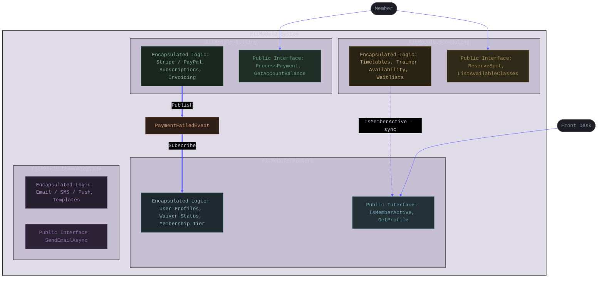

# Example

```mermaid
%%{init: 
    {
        "theme": "base", 
        "themeVariables": 
        {
            "primaryColor": "rgb(207, 197, 197)", 
            "primaryTextColor": "#ccccdd", 
            "primaryBorderColor": "#444455", 
            "lineColor": "#5d5dff", 
            "secondaryColor": "#1a1a22", 
            "tertiaryColor": "#16161e", 
            "background": "#47802600", 
            "mainBkg": "#4e4e83", 
            "nodeBorder": "#060686", 
            "clusterBkg": "#422a702a", 
            "titleColor": "#ccccdd", 
            "edgeLabelBackground": "#000000", 
            "fontFamily": "monospace"
        }
    }
}%%
graph TB
    classDef members_logic fill:#1e2a30,stroke:#5a8a99,stroke-width:1px,color:#a0bfc9
    classDef members_if    fill:#243238,stroke:#5a8a99,stroke-width:1px,color:#7aacba
    classDef sched_logic   fill:#2a2415,stroke:#8a7040,stroke-width:1px,color:#bfaa80
    classDef sched_if      fill:#302a18,stroke:#8a7040,stroke-width:1px,color:#a08a55
    classDef billing_logic fill:#1a2620,stroke:#4a7a5a,stroke-width:1px,color:#8ab09a
    classDef billing_if    fill:#1e2e26,stroke:#4a7a5a,stroke-width:1px,color:#6a9a7a
    classDef comm_logic    fill:#251e2e,stroke:#7a5a8a,stroke-width:1px,color:#aa90be
    classDef comm_if       fill:#2c2236,stroke:#7a5a8a,stroke-width:1px,color:#9070a8
    classDef event_node    fill:#2e2018,stroke:#8a6040,stroke-width:1px,color:#c09070
    classDef actor         fill:#1e1e26,stroke:#555566,stroke-width:1px,color:#888899
    subgraph System [FitModule System]
        subgraph Members [FitModule.Members]
            M_Logic["Encapsulated Logic: User Profiles, Waiver Status, Membership Tier"]
            M_IF["Public Interface: IsMemberActive, GetProfile"]
        end
        subgraph Scheduling [FitModule.Scheduling]
            S_Logic["Encapsulated Logic: Timetables, Trainer Availability, Waitlists"]
            S_IF["Public Interface: ReserveSpot, ListAvailableClasses"]
        end
        subgraph Billing [FitModule.Billing]
            B_Logic["Encapsulated Logic: Stripe / PayPal, Subscriptions, Invoicing"]
            B_IF["Public Interface: ProcessPayment, GetAccountBalance"]
        end
        subgraph Comm [FitModule.Communication]
            C_Logic["Encapsulated Logic: Email / SMS / Push, Templates"]
            C_IF["Public Interface: SendEmailAsync"]
        end
        S_Logic -.->|"IsMemberActive - sync"| M_IF
        B_Logic ==>|"Publish"| PFE["PaymentFailedEvent"]
        PFE ==>|"Subscribe"| M_Logic
    end
    User(["Member"]) --> S_IF
    User --> B_IF
    Admin(["Front Desk"]) --> M_IF
    class M_Logic members_logic
    class M_IF members_if
    class S_Logic sched_logic
    class S_IF sched_if
    class B_Logic billing_logic
    class B_IF billing_if
    class C_Logic comm_logic
    class C_IF comm_if
    class PFE event_node
    class User,Admin actor
```

To read more, please take a look at: [Fit Module System](https://github.com/adamwyr/fit-module-system)